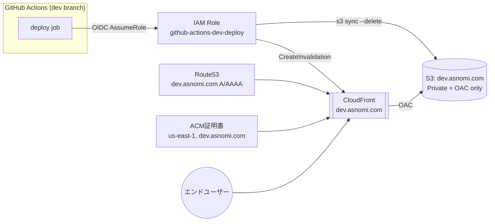

# 設計書：トラックD（インフラ / Terraform・非機能設計）

**対象タスク:** T3-4（ブランチ別マルチ環境デプロイ）のインフラプロビジョニング部分（検証環境: `dev.asnomi.com`）

**参照元:** [task.md](../task.md)（WBS） / [要件定義書.md](./要件定義書.md) / [設計書_トラックC_インフラCICD.md](./設計書_トラックC_インフラCICD.md)（トラックCへの払い出し先）

**対応要件:** F-204, NF-101, NF-202

**Document Version:** 0.2（apply実行・実機構築完了を反映）

**Date:** 2026-08-30（初版）／2026-08-30改訂（terraform apply実行完了、実機構築結果を反映）

---

## 0. 前提・スコープ

- 本書は検証環境（`dev.asnomi.com`）のAWSリソースをTerraformで構築するための設計書。
- 本番環境（`asnomi.com`）は既存の手動/CloudFormation構築のまま**変更しない**。今回作成するTerraformコードは本番環境を対象外とするが、`terraform/modules/static-site` は将来的に本番のTerraform化にも再利用できる構成にしてある。
- 実際の`terraform apply`実行はユーザー（インフラ管理者）が最終承認の上で行う。本書とコードは設計・実装であり、apply自体の実行タイミングは別途確認する。

---

## 1. 前提調査で判明した事実

Terraform設計にあたり、AWS CLI（読み取り専用コマンド）で現行環境を確認した。

| 項目 | 内容 |
| --- | --- |
| AWSアカウントID | `566759952246` |
| ドメイン | **`asnomi.com`**（要件定義書中の表記「asnoni.com」は誤字と判断し、本書以降は実際のドメイン`asnomi.com`で統一する） |
| Route53ホストゾーンID | `Z13MX47JV7ZFKX`（`asnomi.com.`） |
| 本番S3バケット | `asnomi.com` |
| 本番CloudFrontディストリビューション | `E3DNAV0NRDDLND`（エイリアス`asnomi.com`設定済み） |
| ACM証明書（`us-east-1`） | `arn:aws:acm:us-east-1:566759952246:certificate/0d3fbc67-1eb8-4c98-aca1-81ea2a81e0e4`、**`asnomi.com`単体のみでワイルドカードではない**（SAN確認済み） |
| **既存のオーファンリソース** | CloudFrontディストリビューション`EHAFG1OU9KCD7`（オリジン`dev.asnomi.com.s3.amazonaws.com`、エイリアス未設定）が存在。`CallerReference`が2020年頃のタイムスタンプであり、CloudFormationスタック一覧にも該当なし。オリジン先のS3バケット`dev.asnomi.com`は現存せず（404）、OAC/OAIも未設定。**2020年頃の検証作業の残骸と判断** |

### 1.1 対応方針（ユーザー確認済み）

- **既存の`EHAFG1OU9KCD7`は削除し、Terraform管理下の新規リソースに一本化する。**（オーファン化・セキュリティ設定が不十分なため）
  - 削除はCloudFront仕様上「無効化 → 反映待ち → 削除」の2段階操作が必要。**Terraform適用前に、AWSコンソール／CLIで別途明示的な承認を得たうえで実施する**（本書のコード変更には含まれない、実行時の別アクション）。
- **ACM証明書は`dev.asnomi.com`単体で新規発行する**（ワイルドカードではないため）。Route53 DNS検証をTerraformで自動化する。

---

## 2. 全体構成



**設計の骨子:**
- S3バケットは完全非公開（Block Public Access全ON）。CloudFrontの **Origin Access Control (OAC)** 経由のみアクセス許可。
- GitHub ActionsのAWS認証は**OIDC（長期アクセスキー不使用）**。リポジトリ・ブランチ（`refs/heads/dev`）を信頼ポリシーで限定し、キー漏洩リスクそのものを排除する。
- IAMロールの権限は対象S3バケット・対象CloudFrontディストリビューションのみに限定した最小権限。
- 本番（`asnomi.com`）・検証（`dev.asnomi.com`）は完全に別リソース（別S3バケット・別CloudFrontディストリビューション）とし、設定ミスの影響が本番に波及しない構成とする。

---

## 3. Terraformディレクトリ構成

```
terraform/
├── bootstrap/              # tfstate保存用S3+DynamoDB（最初の1回のみ、local stateで管理）
│   ├── main.tf
│   ├── variables.tf
│   └── outputs.tf
├── global/
│   └── github-oidc/        # GitHub Actions用IAM OIDCプロバイダ（アカウントに1つのみ、dev/prod共用）
│       ├── main.tf
│       ├── variables.tf
│       └── outputs.tf
├── envs/
│   └── dev/                 # 検証環境の実体（S3リモートバックエンド管理）
│       ├── main.tf
│       ├── variables.tf
│       └── outputs.tf
└── modules/
    └── static-site/          # 再利用可能モジュール（S3+CloudFront+ACM+DNS+IAMロール）
        ├── versions.tf
        ├── s3.tf
        ├── cloudfront.tf
        ├── acm.tf
        ├── dns.tf
        ├── iam.tf
        ├── variables.tf
        └── outputs.tf
```

`modules/static-site` は環境名・ドメイン名等をパラメータ化しているため、将来的に `envs/prod/` を追加すれば本番環境もTerraform管理へ移行できる（本タスクのスコープ外・今回は作成しない）。

---

## 4. Terraform state管理

- tfstateは **S3リモートバックエンド + DynamoDBロック** で管理する（ユーザー確認済み）。
- `terraform/bootstrap/` のみ、tfstate自体を保存する場所がまだ存在しないという鶏卵問題があるため、例外的にlocal stateで一度だけ実行する。
  - 生成される`terraform.tfstate`は`.gitignore`で除外済み。実行者（インフラ管理者）が個別に保管すること。
- 以降の`global/github-oidc`・`envs/dev`はS3バックエンド（バケット: `asnomi-terraform-state-566759952246`、ロックテーブル: `asnomi-terraform-state-lock`）を使用する。
- `envs/dev`は`terraform_remote_state`データソースで`global/github-oidc`の出力（OIDCプロバイダARN）を参照する。

---

## 5. セキュリティ設計

依頼の「キーが流出したらまずい」を踏まえ、以下を徹底する。

| 項目 | 対応 |
| --- | --- |
| AWS認証情報の長期保存 | **一切行わない。** GitHub ActionsはOIDCで一時クレデンシャルを都度取得する（`AWS_ACCESS_KEY_ID`等のSecretsは不要） |
| IAMロールの信頼範囲 | `sub`クレームで`repo:asnomi/ReFactory:ref:refs/heads/dev`に限定。他ブランチ・フォークからは引き受け不可 |
| IAMロールの権限範囲 | 対象S3バケットへの`PutObject`/`DeleteObject`/`ListBucket`、対象CloudFrontディストリビューションへの`CreateInvalidation`のみ（最小権限） |
| S3バケットの公開設定 | Block Public Access全項目ON。バケットポリシーはCloudFrontサービスプリンシパル（`SourceArn`条件で対象ディストリビューションに限定）からの`GetObject`のみ許可 |
| S3バケットの暗号化 | デフォルトSSE-S3（AES256）を有効化 |
| S3バケットのバージョニング | 有効化（`s3 sync --delete`による誤削除からの復旧用。トラックC設計書6章の推奨事項に対応） |
| CloudFrontの配信方式 | HTTPS必須（`redirect-to-https`）、TLS 1.2以上（`TLSv1.2_2021`） |
| Origin Access | OAC（Origin Access Control。旧式のOAIより推奨される最新方式）を使用 |

---

## 6. 適用手順・実行結果

**2026-08-30、ユーザー承認のうえ実行完了。** 以下、実施した手順と結果。

1. **既存オーファンリソースの削除** ✅ 完了
   - CloudFrontディストリビューション`EHAFG1OU9KCD7`を無効化 → `Deployed`状態を確認 → 削除。削除後`GetDistribution`で`NoSuchDistribution`を確認済み。
2. `terraform/bootstrap/` を apply ✅ 完了（tfstate用S3バケット・DynamoDBロックテーブル作成）
3. `terraform/global/github-oidc/` を apply ✅ 完了（OIDCプロバイダ作成）
   - **apply中に判明した不具合：** コード内の`thumbprint_list`が39文字（1文字不足）でTerraformのバリデーションエラーとなった。`openssl s_client`で`token.actions.githubusercontent.com`の実際のTLS証明書チェーンから中間CA証明書のSHA1フィンガープリントを取得し直し、正しい40文字の値に修正して解消（`terraform/global/github-oidc/main.tf`）。
4. `terraform/envs/dev/` を apply
   - **1回目：失敗。** S3バケット名を`domain_name`（`dev.asnomi.com`）とそのまま同一にしていたため、`BucketAlreadyExists`（S3バケット名はAWS全体でグローバルに一意な必要があり、他アカウントで既に使用済みだった）で失敗。ACM証明書・IAMロール・OACは作成成功。
   - **対応：** `modules/static-site`に`bucket_name`変数を新設し、`domain_name`（DNS/CloudFrontエイリアス用）とS3バケット名を分離。`envs/dev`では`bucket_name = "asnomi-dev-site-566759952246"`を使用するよう変更。
   - **2回目：成功。** 残りのS3バケット本体・CloudFrontディストリビューション・Route53レコード（A/AAAA）を作成し、apply完了。
5. 実機動作確認 ✅ 完了
   - DNS解決：`dev.asnomi.com` → CloudFrontのIPアドレス群に正しく解決
   - HTTPS/TLS：ハンドシェイク成功（ACM証明書が正しくバインドされている）
   - アクセス制御：コンテンツ未デプロイの状態で`403 AccessDenied`（S3非公開設定・OAC経由アクセス制御が正しく機能している証跡。公開バケットであればこの時点でエラー内容が異なる）

### 6.1 最終的なリソース出力値（トラックCへ払い出し）

| 出力名 | 値 |
| --- | --- |
| `bucket_name` | `asnomi-dev-site-566759952246` |
| `distribution_id` | `E14202WQ2RVGSJ` |
| `distribution_domain_name` | `d1cp5q5toxt6i0.cloudfront.net` |
| `deploy_role_arn` | `arn:aws:iam::566759952246:role/github-actions-dev-deploy` |
| `acm_certificate_arn` | `arn:aws:acm:us-east-1:566759952246:certificate/def86e2f-d231-4b50-9941-eb11f7c1a594` |

### 6.2 GitHubでの値管理方針（Variables、Secretsではない）

上記のうちトラックC（GitHub Actionsデプロイワークフロー）が使う3値を、**GitHubの`dev` Environment Variables**（Secretsではない）に登録する。

| 出力名 | 登録先（GitHub `dev` Environment Variables） |
| --- | --- |
| `bucket_name` | `S3_BUCKET_NAME` = `asnomi-dev-site-566759952246` |
| `distribution_id` | `CLOUDFRONT_DISTRIBUTION_ID` = `E14202WQ2RVGSJ` |
| `deploy_role_arn` | `AWS_DEPLOY_ROLE_ARN` = `arn:aws:iam::566759952246:role/github-actions-dev-deploy` |

トラックC側は[設計書_トラックC_インフラCICD.md](./設計書_トラックC_インフラCICD.md) 5.2節の単一環境前提のSecrets構成を、GitHub Environments機能でdev/prod別に分離する対応が必要（同設計書T3-4節に記載済み）。

- 上記3値は、いずれもAWSコンソールを見れば分かる非機密情報であり、かつIAMロールはOIDC信頼ポリシー（リポジトリ・ブランチ限定）で保護されているため、ARNが露出しても実害はない。そのため、GitHubの **Secrets ではなく Environment Variables**（`dev` Environment）に登録し、値の可視性・管理性を優先する。
- 真に機密な値（長期AWSアクセスキー等）は本設計に一切登場しない（5章参照）。したがって`dev` EnvironmentにSecretsを登録する必要はない。
- 登録作業は`gh` CLI未導入のため未実施。GitHub UIの Settings → Environments → `dev` → Variables から手動登録するか、`gh` CLI導入後に`gh variable set --env dev`で登録する（6.1節の値を使用）。
- `envs/dev`のTerraform自体（`terraform apply`の実行）は今回のスコープでは**手元（ローカルCLI）実行のまま**とし、CI化（GitHub ActionsからのTerraform実行）は行わない。理由：Terraform実行用にS3/CloudFront/ACM/Route53/IAMを作成できる強い権限のOIDCロールが別途必要になり、設計・レビューの負荷が増すため、今回のスコープ（検証環境構築）ではオーバースペックと判断。将来的にTerraform自体のCI化を検討する場合は別途設計する。

---

## 7. コスト影響（T4-4への追加試算）

検証環境追加による増分コスト（[設計書_トラックC_インフラCICD.md](./設計書_トラックC_インフラCICD.md) 7章の本番試算に対する追加分）。

| 項目 | 月額目安（USD） | 備考 |
| --- | --- | --- |
| S3ストレージ・リクエスト | 〜$0.1未満 | 本番と同程度のサイト規模、アクセス数は少ない想定 |
| CloudFrontデータ転送 | 〜$0.5未満 | 検証用途のため実アクセス数は僅少と想定。`PriceClass_100`（北米/欧州/アジアのみ）でコスト抑制 |
| CloudFront Invalidation | $0 | 無料枠内 |
| ACM証明書 | $0 | ACM証明書自体は無料 |
| DynamoDB（tfstateロック） | $0程度 | オンデマンド課金、極小アクセス量のため実質無視できる水準 |
| **合計目安** | **月額 $1未満** | 本番試算（月額$2〜$8）に対する増分としては軽微 |

---

## 8. 未確定事項・要フォロー

1. ~~既存オーファンリソース（`EHAFG1OU9KCD7`）の削除実行~~ → ✅ 2026-08-30実施完了（6章参照）
2. ~~`terraform apply`の実行~~ → ✅ 2026-08-30実施完了（bootstrap・global/github-oidc・envs/devすべて適用済み、6章参照）
3. **GitHubの`dev` Environment Variables登録が未実施** — `gh` CLIがローカル環境に未導入のため、6.1節の3値をGitHub UIから手動登録するか、`gh` CLI導入後に実施する（トラックC側のワークフロー実装前に必要）
4. 本番環境（`asnomi.com`）のTerraform化は本タスクのスコープ外。将来対応する場合は`envs/prod/`を追加する形で本書のモジュールを再利用できる
5. 要件定義書の「asnoni.com」表記は実際のドメイン「asnomi.com」との誤字と判断したが、要件定義書自体の訂正はPJ管理／レビューセッションの判断に委ねる
6. Terraformバックエンド設定の`dynamodb_table`パラメータがTerraform 1.10+で非推奨（新方式`use_lockfile`推奨）という警告が出る。動作に支障はないが、将来のTerraformバージョンアップ時に見直しを検討する
