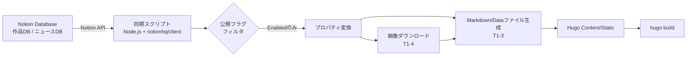

# 設計書：Notionデータ連携（トラックB）

**対象タスク:** T1-1〜T1-4（Phase 1. Notionデータ連携基盤）
**参照元:** [task.md](./task.md) / [要件定義書.md](./要件定義書.md)（F-101, F-102）

**方針:** 本設計書は仕様・構造の定義を目的とし、実装コード（Node.jsスクリプト本体等）は含めない。実装時に本設計書を仕様書として参照する。

---

## 0. 全体データフロー



- 同期スクリプトはGitHub Actions実行時（cronトリガー、T0-1決定）の最初のステップとして実行し、生成物は**ビルド直前の一時データ**として扱う（リポジトリへコミットし戻さない／NF-201の思想に合致）。
- 画像ダウンロード（T1-4）は、Notionの画像URLが有効なうちに、プロパティ取得と同一スクリプト実行内で完結させる（1時間の有効期限に対する設計上の要点）。

---

## 1. T1-1. Notionデータベース設計（プロパティ定義）

Notion側に以下2つのデータベースを作成する。フロントマター変換のしやすさを優先し、採用テーマ「Kross」の平型フロントマター構造（`title` / `date` / `image` / `categories` / `description`）とほぼ1:1対応するプロパティ構成とする。

### 1.1 作品情報データベース（Works DB）

| プロパティ名（Notion） | 型 | 必須 | Hugo変換先 | 備考 |
| --- | --- | --- | --- | --- |
| 名前（Title列） | Title | ○ | `title` | Notion既定のタイトル列を流用 |
| 制作日 | Date | ○ | `date` | ISO8601形式で取得しそのまま利用 |
| サムネイル画像 | Files & media | ○ | `image`（ローカル永続化後のパス） | 1点のみ運用を基本とする（複数点は1.3節参照） |
| ジャンル | Multi-select | ○ | `categories` | ギャラリーのカテゴリ絞り込み（F-303）に使用。Kross標準のShuffle.jsフィルタが参照する項目 |
| 説明文 | Text（Rich text） | ○ | `description` | 一覧・詳細に表示する短文説明 |
| 公開フラグ | Select（Enabled / Disabled） | ○ | （非出力・フィルタ用） | `Enabled` のレコードのみ同期スクリプトの取得対象とする。`Disabled` は取り込み対象外（下書き・非表示扱い） |
| スラッグ | Text | △（任意） | ファイル名（`content/works/{slug}.md`） | 未入力時はタイトルから自動生成（スラグ化）する仕様とする |
| 表示順 | Number | △（任意） | フロントマター拡張項目 `weight` 等 | 手動での並び替えが必要になった場合に使用。初期スコープでは未使用でも可 |
| 制作年（補助） | Formula（制作日から年を抽出） | △（任意） | — | 年別グルーピングの検討（T2-4）で必要になった場合に利用 |

**取得対象の絞り込み方針:** 同期スクリプトは `公開フラグ = Enabled` を `filter` 条件としてNotion API側で絞り込む（アプリ側フィルタではなくAPIクエリのfilterで行い、不要データを取得しない）。

### 1.2 ニュース記事データベース（News DB）

| プロパティ名（Notion） | 型 | 必須 | Hugo変換先 | 備考 |
| --- | --- | --- | --- | --- |
| タイトル（Title列） | Title | ○ | `title` | |
| 本文 | ページ本文（Notionブロック） | ○ | Markdown本文（`.md`のフロントマター以下） | プロパティではなくページ本体に記述。取得にはBlocks APIの再帰取得が必要（1.4節参照） |
| 公開日 | Date | ○ | `date` | 一覧の並び順・最新N件表示（F-304）に使用 |
| 公開フラグ | Select（Enabled / Disabled） | ○ | （非出力・フィルタ用） | Works DBと同様に `Enabled` のみ取得対象とする |
| スラッグ | Text | △（任意） | ファイル名（`content/news/{slug}.md`） | |
| サムネイル画像 | Files & media | △（任意） | `image` | ニュース一覧にサムネイルを出す場合のみ使用 |

### 1.3 補足：複数画像の扱いについて

作品ごとに複数画像（ギャラリー詳細ページでのカルーセル等）を持たせる可能性を考慮し、「サムネイル画像」に加えて以下いずれかの拡張を将来的に選択できるようにしておく（初期スコープでは単一画像運用のため未実装）。

- 案A: Files & media列を複数ファイル格納可能な仕様のまま使い、配列として扱う
- 案B: 「ギャラリー画像」列を別途Multi-file列として追加する

いずれの場合もT1-4の画像永続化処理は「1プロパティ内の複数ファイル」を扱える設計にしておく（2.2節参照）。

### 1.4 ニュース本文の取得方式について

ニュース記事の本文はNotionのプロパティではなくページ本体（ブロック）に記述する運用とするため、`pages.retrieve` だけでなく `blocks.children.list` を再帰的に呼び出してブロックツリーを取得し、Markdownへ変換する処理が必要になる（T1-3で詳細設計）。ブロック→Markdown変換は既存の変換ロジック（見出し・段落・リスト・画像ブロック程度の限定的なサポートで初期スコープは十分とする）を自作する方針とする。

---

## 2. T1-2. Notion Integration作成・API接続

### 2.1 Integration作成手順（設計方針）

1. [notion.so/my-integrations](https://www.notion.so/my-integrations) で **Internal Integration** を新規作成する（Publicにはしない。単一ワークスペース内での利用のため）。
2. Capabilities（権限）は **Read content** のみ付与する（Insert/Update/削除権限は不要。同期は一方向・読み取り専用のため）。
3. 発行された **Internal Integration Secret**（APIトークン）を控える。
4. 作品情報DB・ニュース記事DBそれぞれのページ右上「Connections」からこのIntegrationを個別に招待（Share）する。招待しないとAPI経由で当該DBが見えない点に注意。
5. 各DBのDatabase ID（DBページURLに含まれる32文字のID）を控える。

### 2.2 シークレット管理方針

| シークレット名（例） | 用途 | 保管先 |
| --- | --- | --- |
| `NOTION_API_KEY` | Integration Secret | GitHub Actions Secrets（リポジトリ or Environment Secrets） |
| `NOTION_WORKS_DB_ID` | 作品情報DBのID | 同上（機微情報ではないためSecretsでなくVariablesでも可） |
| `NOTION_NEWS_DB_ID` | ニュース記事DBのID | 同上 |

- ローカル開発時は `.env`（`.gitignore`対象）で同名の環境変数を管理する。
- APIキーをリポジトリやコミット履歴に残さないことを徹底する（T4-3のゼロ・メンテナンス運用フローの前提でもある）。

### 2.3 API接続処理の設計

- **使用ライブラリ:** `@notionhq/client`（公式Node.js SDK）
- **実行環境:** GitHub Actions上のNode.jsステップ（T0-3で決定済みの自作スクリプト方針に準拠）

**データ取得フロー（設計レベル）**

1. `Client` を `NOTION_API_KEY` で初期化する。
2. 作品情報DB・ニュース記事DBそれぞれに対し `databases.query` を実行する。
   - `filter`: 公開フラグ = Enabled
   - `sorts`: 制作日／公開日の降順
3. レスポンスの `has_more` / `next_cursor` を見て、**ページネーション**を考慮したループ取得を行う（1回のクエリで最大100件までのため、100件超のデータ量になった場合に備える）。
4. 各ページ（レコード）の `properties` を、1章で定義したプロパティ名をキーに、Notion固有のプロパティ型（`title` / `date` / `select` / `multi_select` / `files` / `rich_text` 等）から扱いやすいプレーンな値へ変換するマッピング処理を通す（プロパティ型ごとの正規化関数を用意する）。
5. ニュースDBについては、上記に加えて2.4節の本文取得処理を行う。

### 2.4 レート制限・エラーハンドリング方針

- Notion APIのレート制限（平均 約3リクエスト/秒）を踏まえ、逐次実行を基本としつつ、429エラー発生時は指数バックオフでリトライする設計とする。
- 個別レコードの取得・変換に失敗した場合は、**そのレコードのみスキップしてログ出力**し、ビルド全体を失敗させない方針とする（1件の不備で全体デプロイが止まる事態を避ける）。
- スクリプト全体が致命的に失敗した場合（認証エラー等）は、GitHub Actionsのジョブを失敗させ、後続のビルド・デプロイステップに進ませない。

---

## 3. T1-3. Hugo Content/Data変換処理（参考・関連設計）

T1-1・T1-2で取得・正規化したデータを、Kross採用（T0-2）を前提としたフロントマター構造でMarkdownファイルへ出力する。

- 出力先: `content/works/{slug}.md`、`content/news/{slug}.md`
- フロントマター（TOML/YAML、Krossの標準に合わせる）:
  ```
  title: "{title}"
  date: {date}
  image: "{ローカル永続化後の画像パス}"
  categories: [{categories}]
  description: "{description}"
  ```
- ニュース記事は本文（ブロック→Markdown変換結果）をフロントマター以下に出力する。
- 既存ファイルとの差分がない場合は書き込みをスキップする（無駄な変更によるHugoの不要な再ビルド範囲拡大を避ける）ことを検討する。

※本節はT1-4（画像パス）と直接連携するため参考として記載。詳細な変換仕様は別途T1-3設計時に確定する。

---

## 4. T1-4. 画像のローカル永続化処理の設計

### 4.1 課題

Notion APIが返す画像URL（Notion内部にアップロードされたファイルの場合）は**署名付きURLであり約1時間で失効する**。生成されたHugoサイトが恒久的にこのURLを参照すると、ビルドから1時間後にはリンク切れとなる（F-102）。

### 4.2 処理タイミング

画像のダウンロードは、**同期スクリプト実行中・プロパティ取得の直後**に行う（Notionからデータを取得したスクリプトの同一実行プロセス内）。取得したURLをキャッシュしたり後続ステップへ受け渡したりせず、その場でダウンロードを完了させることで有効期限切れリスクを排除する。

### 4.3 保存先・ディレクトリ構成

Hugoの Image Processing 機能（NF-102、WebP変換・リサイズ）を活用する前提から、Hugoのアセットパイプラインが参照できる **`assets/images/` 配下** に保存する方針とする（`static/` は無加工配信用のため、画像処理を要する運用には不向き）。

```
assets/
  images/
    works/
      {slug}/
        {slug}-{連番 or ファイルID}.{拡張子}
    news/
      {slug}/
        {slug}-{連番 or ファイルID}.{拡張子}
```

- `{slug}` はT1-1で定義したスラッグ（未設定時はタイトルから自動生成したもの）を使用し、作品・記事単位でディレクトリを分ける。
- 複数画像（1.3節）に対応できるよう、ファイル名にはNotion側のFile ID（またはプロパティ内でのインデックス）を含め、衝突を避ける。

### 4.4 命名規則

| 要素 | 内容 |
| --- | --- |
| ベース名 | `{slug}` |
| 識別子 | Notionファイルオブジェクトの識別要素（ファイル名 or インデックス。Notion APIはFile IDを直接は返さないため、`name` プロパティまたは取得順のインデックスを利用） |
| 拡張子 | 元ファイルのMIMEタイプ／URL末尾の拡張子から判定 |

例: `assets/images/works/night-garden/night-garden-01.jpg`

### 4.5 ダウンロード処理仕様

1. プロパティ変換処理（2.3節手順4）で `files` 型プロパティを検出したら、各ファイルのURLに対してHTTP GETを実行しバイナリを取得する。
2. 取得したバイナリを4.3節の命名規則に従ったパスへ書き込む。
3. 書き込んだローカルパス（Hugoのフロントマターで参照する相対パス、例: `images/works/night-garden/night-garden-01.jpg`）をレコードのデータに付与し、T1-3のMarkdown生成処理へ引き渡す。

### 4.6 リンク切れ防止のための参照パス書き換え

- フロントマター上の `image` は**Notionの元URLを一切使用せず**、常に4.3節のローカルパスのみを書き込む。
- ニュース本文中に画像ブロックが含まれる場合も同様に、本文Markdown変換時点で画像URLをローカルパスへ置換してから出力する（本文変換処理はT1-3側の責務だが、画像ダウンロード自体はここで定義した処理を共通利用する）。

### 4.7 再ビルド時の差分処理（冪等性）方針

- 生成物（Markdown・画像）はビルドの都度リポジトリへコミットしない一時データであるため、GitHub Actions実行のたびに全件再ダウンロードが発生し得る。頻度（T0-1: 数時間おき）とデータ量次第では、以下を検討する。
  - GitHub Actionsの `cache` アクションで `assets/images/` をキャッシュし、Notion側の `last_edited_time` を用いて変更があったレコードのみ再ダウンロードする差分方式
  - 初期スコープでは差分方式は必須要件とはせず、**全件再取得でもビルド時間・Notion APIレート制限の許容範囲に収まるか**をT5-1（結合テスト）で確認したうえで、必要な場合のみ導入する
- 関連要件: NF-202（コスト最適化）の観点からも、GitHub Actions実行時間の圧縮は将来的な改善対象として設計上ここに記録しておく。

### 4.8 異常系

- ダウンロード失敗（タイムアウト・404等）時は、該当ファイルのみスキップしログへ記録する。`image` フィールドは空、またはフォールバック用のプレースホルダー画像パスを設定し、**1画像の失敗で同期処理全体を止めない**。

---

## 5. 未確定事項（本設計書時点）

- 4.3節の保存先を `assets/` とする方針は、Kross（T2-0モック）でのImage Processing活用方法が確定次第、最終決定とする。モック検証の結果次第では `static/` 運用（無加工）へ変更する可能性がある。
- 4.7節の差分ダウンロード方式の要否は、T5-1結合テストでのビルド時間実測を踏まえて判断する。
- ニュース本文のブロック→Markdown変換（1.4節・T1-3）でサポートするブロック種別の範囲は、実際のNotion運用内容（画像・見出し・箇条書き以外に何を使うか）のヒアリング後に確定する。
