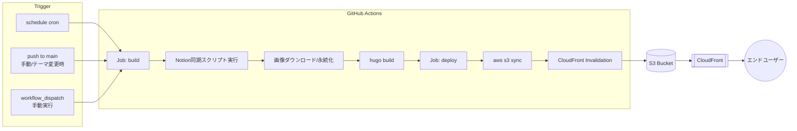

# 設計書：トラックC（インフラ / CI-CD）

**対象タスク:** T3-1（GitHub Actionsワークフロー設計）／T3-2（S3同期処理設計）／T3-3（CloudFrontキャッシュ無効化処理設計）／T4-1（インフラ可用性の確認）／T4-4（インフラコスト試算）

**参照元:** [task.md](./task.md)（WBS） / [要件定義書.md](./要件定義書.md)（Version 1.0）

**対応要件:** F-201, F-202, F-203, NF-101, NF-202

**Document Version:** 0.4（Track A調整事項の内容精査：YAML順序バグ修正＋本番ビルド未検証リスクを追記）

**Date:** 2026-08-24（初版）／2026-08-25改訂（Kross_モック検証メモ.mdの実装事情をT3-1に反映）／2026-08-25再改訂（8章 未確定事項6〜9をTrack A側で確定・反映）／2026-08-25再々改訂（Track A確定事項を実機`asnomi-kross-mock/`と突き合わせて内容精査。YAMLのステップ順序バグを修正し、PostCSS/PurgeCSS本番ビルドが未実証である点をリスクとして明記）

---

## 0. 前提・スコープ

- 本書は **設計（骨格・方針決定）** のみを対象とし、実装コード（Node.jsスクリプト本体、Hugoテンプレート等）は含まない。GitHub Actions YAMLについては「骨格」を示すが、Secrets値・具体的なNotionプロパティ名等は実装フェーズで確定する。
- T0-1決定事項を前提とする：**Notion→GitHub Actions の発火方式は cron（`schedule`）方式**。webhook方式（`repository_dispatch`）への切替を将来的に行えるよう、トリガー部分とビルド/デプロイ処理を疎結合に設計する。
- T0-2（テーマ）は「Kross」仮採用（モック確認後に正式決定）。本設計はテーマ選定に依存しない（`public/` ディレクトリを配信する構成は共通のため）。
- 現行インフラは AWS S3 + CloudFront。本設計は **現行構成を踏襲** しつつ、GitHub Actionsからのデプロイ経路を新設する。既存バケット／ディストリビューションの再利用を前提とし、新規構築が必要な箇所のみ明示する。

---

## 1. 全体パイプライン概要



**設計方針:**
- `build` と `deploy` をジョブ分離し、`build` の成果物（`public/`）を `actions/upload-artifact` → `download-artifact` で `deploy` ジョブへ引き渡す。理由：将来的にPRプレビュー等でビルドのみ走らせたいケースに対応しやすく、デプロイ用のAWS認証情報を持つジョブの責務を最小化（最小権限）できるため。
- Notion同期処理・画像永続化処理（T1系タスク、Track A相当）は本設計の対象外だが、`build` ジョブ内の1ステップとして呼び出される前提でワークフローを設計する。

---

## 2. T3-1. GitHub Actionsワークフロー設計

### 2.1 トリガー設計

| トリガー | 用途 | 備考 |
| --- | --- | --- |
| `schedule`（cron） | Notion更新の定期反映（メイン運用経路） | 頻度は下記2.2で試算のうえ決定 |
| `push`（`main` ブランチ、`hugo.toml` / `layouts/` / `themes/` 等の変更時） | テーマ・レイアウト修正時の即時反映 | `paths` フィルタでNotion由来データのみの変更を除外し、無駄なビルドを避ける |
| `workflow_dispatch` | 緊急時・検証時の手動実行 | 常設しておく（運用上の保険） |

> **将来のwebhook移行に向けた設計配慮：** トリガー種別に関わらず後続ジョブ（`build`/`deploy`）の中身は完全に同一にする。`schedule` 削除 → `repository_dispatch` 追加のみで移行できる状態を維持する（申し送り事項の方針に準拠）。

### 2.2 cron頻度の試算・決定

GitHub Actions無料枠：**プライベートリポジトリ 2,000分/月**（Linuxランナーは1分=1分換算）。

> **2026-08-25更新：** [Kross_モック検証メモ.md](./Kross_モック検証メモ.md)により、採用テーマ「Kross」が**Hugo Modules**（`go.mod`＋`hugo mod tidy`、CI側にもGoが必要／初回は外部からのモジュール取得でネットワークアクセスと追加時間が発生）と、**本番ビルド限定でNode.js＋PostCSS/PurgeCSS一式が必要**（`hugo`コマンドのデフォルト実行環境は`production`のため、CIの`hugo --minify`は必ずこの分岐を通る）という実装事情を持つことが判明。1回あたりの実行時間見積りをこれを踏まえて引き上げる（詳細は2.4）。

**前提（改訂）:**
- 1回あたりの実行時間目安：Notion同期(1〜2分) + Go/Nodeセットアップ・依存解決(1〜3分、キャッシュ有無で変動) + hugo build(1分未満) + s3 sync(1分未満) + invalidation(数秒) ≒ **4〜7分/回**（Goモジュール／npmキャッシュが効かない初回や、キャッシュ切れ時は上振れしうる。安全側に見て**8分/回**で試算）

| 頻度 | 月間実行回数 | 月間消費分（8分/回） | 無料枠(2,000分)に対する消費率 |
| --- | --- | --- | --- |
| 1時間おき | 約720回 | 5,760分 | **超過（不可）** |
| 3時間おき | 約240回 | 1,920分 | 96%（**余裕なし、非推奨**） |
| 6時間おき | 約120回 | 960分 | 48% |
| 12時間おき | 約60回 | 480分 | 24% |

**推奨: 6時間おき（`0 */6 * * *`、1日4回）で変更なし**
- 5分/回想定だった旧試算では消費率30%だったが、Kross実装事情を織り込んだ8分/回想定でも**48%に収まり、依然として無料枠内に十分な余裕がある**ため、頻度自体の見直しは不要と判断。
- 一方で3時間おきは96%と無料枠をほぼ使い切ってしまい、pushトリガーや将来のCI追加の余地がなくなるため非推奨とする（旧試算では60%で許容範囲としていたが、この結論は撤回）。
- リポジトリがプライベートかパブリックかで無料枠上限が変わる（パブリックは無制限）ため、**実装着手前にリポジトリ可視性を確認**すること（未確定事項として要フォロー、8章参照）。

### 2.3 ワークフロー骨格（YAML設計イメージ）

> Kross実装事情（2.4）を反映し、`setup-go`によるGo導入・Goモジュールキャッシュ・`setup-node`によるNode導入・npm依存インストール・明示的な`--environment production`指定を追加した版。

```yaml
name: build-and-deploy

on:
  schedule:
    - cron: '0 */6 * * *'   # 6時間おき（UTC基準の点に注意）
  push:
    branches: [main]
    paths:
      - 'layouts/**'
      - 'assets/**'
      - 'hugo.toml'
      - 'go.mod'
      - 'go.sum'
      - 'package.json'
      - 'package-lock.json'
      - '.github/workflows/**'
  workflow_dispatch: {}

concurrency:
  group: ${{ github.workflow }}
  cancel-in-progress: true   # 前回実行が残っていれば新しい実行を優先

permissions:
  contents: read
  id-token: write   # AWS OIDC連携用（5章参照）

jobs:
  build:
    runs-on: ubuntu-latest
    steps:
      - uses: actions/checkout@vX
        with:
          submodules: recursive   # テーマ本体をgit submoduleで持つ場合。Hugo Modules経由の依存はsubmodule対象外

      - uses: actions/setup-go@vX
        with:
          go-version: '1.21'   # モック検証環境（Go 1.19+）を踏まえ、実装時にLTS相当へ確定
      - name: Goモジュールキャッシュ
        uses: actions/cache@vX
        with:
          path: |
            ~/go/pkg/mod
          key: ${{ runner.os }}-gomod-${{ hashFiles('go.sum') }}
          restore-keys: |
            ${{ runner.os }}-gomod-

      - uses: actions/setup-node@vX
        with:
          node-version: '20'
          cache: 'npm'
      - name: npm依存インストール（Notion同期スクリプト用 + 本番ビルド用postcss-cli / @fullhuman/postcss-purgecss 等）
        run: npm ci   # package.jsonはサイト本体ルートに配置（Track A確定、2.4③参照）

      - name: Notionデータ同期（記事/作品取得・画像永続化）
        env:
          NOTION_API_KEY: ${{ secrets.NOTION_API_KEY }}
          NOTION_WORKS_DB_ID: ${{ secrets.NOTION_WORKS_DB_ID }}
          NOTION_NEWS_DB_ID: ${{ secrets.NOTION_NEWS_DB_ID }}
        run: node scripts/sync-notion.js   # ← T1系タスクの成果物（別トラック）。上のsetup-node/npm ciより後段に配置（旧版はこのnodeステップがsetup-node導入前に走る順序バグがあったため修正済み、2.4④参照）

      - uses: peaceiris/actions-hugo@vX
        with:
          hugo-version: '0.152.2'   # モック検証済みバージョンに固定（Hugo Modules利用時はバージョン差異の影響を受けやすいため）
          extended: true

      - name: hugo build（本番ビルド／Hugo Modules解決込み）
        env:
          HUGO_ENVIRONMENT: production
        run: hugo --gc --minify --environment production
        # 初回またはgo.sum変更時はここでHugo Modulesの外部取得（ネットワークアクセス）が発生する
        # ※theme付属のnpmスクリプト`npm run build`は使わず、hugoコマンドを直接呼ぶ（2.4④参照：
        #   `npm run build`には--buildDrafts --buildExpired --buildFutureが含まれ、
        #   Notion側で非公開/期限切れ扱いのコンテンツまで本番公開してしまう事故を避けるため）

      - uses: actions/upload-artifact@vX
        with:
          name: site
          path: public/

  deploy:
    needs: build
    runs-on: ubuntu-latest
    steps:
      - uses: actions/download-artifact@vX
        with:
          name: site
          path: public/
      - name: Configure AWS credentials
        uses: aws-actions/configure-aws-credentials@vX
        with:
          role-to-assume: ${{ secrets.AWS_DEPLOY_ROLE_ARN }}   # OIDC（5章参照）
          aws-region: ap-northeast-1
      - name: S3 sync
        run: |
          aws s3 sync public/ s3://${{ secrets.S3_BUCKET_NAME }} --delete
      - name: CloudFront invalidation
        run: |
          aws cloudfront create-invalidation \
            --distribution-id ${{ secrets.CLOUDFRONT_DISTRIBUTION_ID }} \
            --paths "/*"
```

上記はあくまで骨格。ステップ名・アクションバージョン・Notion同期スクリプトのI/F仕様は実装フェーズで確定する。

### 2.4 Kross実装事情（Hugo Modules・PostCSS/PurgeCSS）を踏まえた設計反映

[Kross_モック検証メモ.md](./Kross_モック検証メモ.md) T2-0/T2-1の検証結果より、当初のワークフロー骨格には無かった以下2点をCI設計に取り込む必要がある。

**① Hugo Modules方式への対応**

- KrossはBootstrap／アイコン／ショートコード等を単体同梱ではなく `go.mod` + `hugo mod tidy` によるHugo Modulesで構成している。
- **CI側の影響：**
  - ランナーに **Go**（モック検証環境と同様に1.19+）が必要 → `actions/setup-go` を追加。
  - `hugo build` 実行時（`hugo mod tidy`を明示的に挟まなくても、`hugo`コマンド自身がgo.sumとの差分検知時に自動でモジュール解決を行う）に**初回またはgo.sum変更時は外部（GitHubのモジュールソース）へのネットワークアクセスが発生**する。GitHub Actionsランナーからのアウトバウンド通信自体は標準で許可されているため到達性の問題はないが、**モジュール取得の分だけ実行時間が伸びる**（2.2のcron頻度試算に反映済み）。
  - 繰り返し実行のたびに毎回フルダウンロードするのは無駄が大きいため、`actions/cache` で `~/go/pkg/mod` をキャッシュし、2回目以降の実行を高速化する設計とした（骨格YAML参照）。キャッシュキーは `go.sum` のハッシュに紐付け、依存変更時のみ再取得させる。
  - Hugoのバージョンは、Hugo Modules利用時はバージョン差異が解決結果やビルド結果に影響しうるため、モック検証済みの `0.152.2` にCI側も固定する（`peaceiris/actions-hugo` の `hugo-version` を明示指定）。

**② 本番ビルド限定のNode.js/PostCSS依存**

- Krossの `layouts/partials/essentials/style.html` は `{{ if and hugo.IsProduction site.Params.purge_css }}` の分岐でPostCSS/PurgeCSS処理を実行する。`hugo server`（development環境）ではこの分岐を通らずNode不要だが、**`hugo` コマンド単体実行時のデフォルト環境は `production`** であるため、CIでの本番ビルド（`hugo --minify` 等）は**必ずこの分岐を通り、Node.js + `postcss-cli` + `@fullhuman/postcss-purgecss` が無いとビルド失敗する**。
- 旧版の骨格YAMLは `actions/setup-node` の導入のみでNotion同期スクリプト用としており、PostCSS関連パッケージのインストールステップが存在していなかった（今回の齟齬の直接原因）。
- **CI側の対応：** `actions/setup-node` の後段に `npm ci`（または `npm install`）ステップを追加し、`package.json` に定義された `postcss-cli` / `@fullhuman/postcss-purgecss` 等のdevDependenciesを導入する設計に変更した。
- `hugo build` 実行時は環境を明示的に `--environment production`（`HUGO_ENVIRONMENT=production` も等価）で指定し、意図せずdevelopment相当のビルドになってPostCSS処理が飛ばされる事故を防ぐ。

**③ Track Aとの要調整事項 → ✅ 2026-08-25 確定（Track A側で検証・決定）**

詳細な検証根拠は[設計書_トラックA_フロントエンド.md](./設計書_トラックA_フロントエンド.md)を参照。以下、CI設計への反映結果のみ記載する。

- **`package.json`の配置階層 → サイト本体ルート（リポジトリルート、`hugo.toml`と同階層）に確定。** `themes/kross`配下ではない。理由：Kross本体のnpmスクリプト（`dev`/`build`、`:example`サフィックス無し）はカレントディレクトリ＝サイトルートを前提に`hugo`コマンドを実行する設計であり、`postcss.config.js`もサイトルートに置く前提でPostCSSがカレントディレクトリを基準に解決するため。モックでの実機ビルドにより確認済み。
  → CI側の`npm ci`・`hugo build`ステップは**working-directory指定不要**（リポジトリルートがそのままサイトルートのため、デフォルトのcheckout直下で完結する）。
- **`site.Params.purge_css`の最終設定値 → `true`（ON）で確定。** 理由：Kross標準ではCSSがファイルリンクではなく`<style>`タグとして各HTMLページに**インライン埋め込み**される構成のため、未パージのCSS（Bootstrap全量含む）をそのまま出力すると全ページで肥大化した`<style>`ブロックを都度読み込むことになり、NF-102（ページロード高速化）への悪影響がむしろ大きい。CI側はいずれにせよNode.js/PostCSS一式の導入が必要な設計（②）のため、ONにしてもCI追加コストは発生しない。→ **2.3のYAML骨格・2.4②の対応はそのまま維持（変更なし）。**
- **Hugo Modules依存（`go.mod`記載のGitHubリポジトリ群）→ すべて公開リポジトリであることを確認済み。** `github.com/gohugoio/*`・`github.com/gethugothemes/*`・`github.com/twbs/bootstrap`のみで構成されており、モック環境での`hugo mod tidy`が認証設定無しで正常完了したことから実証済み。→ **`GOPRIVATE`環境変数・SSH鍵/PAT等の追加Git認証設定は不要。** 2.3のYAML骨格に変更なし。

**④ 内容精査で新たに検出した2件（2026-08-25、Track C側でTrack A確定内容と実機`asnomi-kross-mock/`を突き合わせて発見）**

Track A側の確定事項（上記3項目）自体に誤りはないが、それを反映するにあたり、本設計書側に以下2つの問題があった。

- **[修正済み] YAML内のステップ順序バグ：** 旧版（0.2）の骨格YAMLは、Notion同期スクリプト（`node scripts/sync-notion.js`）を`actions/setup-node`より**前**に実行する順序になっており、このままでは`node`コマンドが見つからずCIが即座に失敗する状態だった（コード上は「setup-nodeで導入したものを使う想定」と書きつつ、実際のステップ順序が逆転していた）。→ 2.3節のYAMLを、`setup-go`→Goキャッシュ→`setup-node`→`npm ci`→Notion同期→Hugoセットアップ→`hugo build`の順に並べ替えて修正済み。

- **[要検証・未解消] 本番ビルド（PostCSS/PurgeCSS経由）のエンドツーエンド動作が実機で一度も成功確認されていない：** Track Aの検証はすべて`hugo server --environment development`（development環境）で行われており、`site.Params.purge_css = true`確定の根拠となった本番ビルド（`hugo`単体実行、環境=production）は、モック検証セッション内では一度も通していない。今回の内容精査にあたり、Track C側で実際に`asnomi-kross-mock/`上で`hugo --minify`（node_modules未インストール状態）を試行したところ、以下のエラーで**即座にビルド失敗**することを確認した。
  ```
  Error: error building site: POSTCSS: failed to transform "/css/style.css" (text/css).
  You need to install PostCSS. See https://gohugo.io/functions/css/postcss/:
  binary with name "postcss" not found in PATH
  ```
  現在のCI設計（`npm ci`で`postcss-cli`等をインストールしてから`hugo build`を実行）はこのエラーの原因（PostCSSバイナリ不在）を解消する構成には**なっている**ものの、`npm ci`込みの本番ビルドが実際に成功する（＝`hugo_stats.json`を参照したPurgeCSSが正しく動作し、意図通りCSSが軽量化される）ことは、ローカル・CIのいずれにおいても**まだ一度も実地検証されていない**。`asnomi-kross-mock/public/`に現存するビルド成果物（`css/style.css`が261KB、Bootstrap全量相当のサイズ）も、purge済みにしては不自然に大きく、development環境での生成物である可能性が高い。
  → **本設計は「確定」ではなく「構成上は正しいはずだが未実証」の状態として扱う。** 実装着手前（できればTrack A側でNode.js導入環境を用意した上で）に、`npm ci && npm run build`相当のコマンド、または本設計のCIワークフローを実際に一度動かし、①ビルドが成功すること、②`public/css/`配下のCSSサイズがpurge前より大幅に縮小していること、の2点を確認するタスクを追加で立てることを推奨する。

---

## 3. T3-2. S3同期処理設計

### 3.1 同期コマンド方針

- `aws s3 sync public/ s3://<bucket> --delete` を採用。
  - `--delete` により、Notion側で削除・非公開化された作品/記事に対応するHugo生成物もS3側から自動削除され、リンク切れ・古いコンテンツの残存を防止できる（NF-201のゼロメンテナンス思想に合致）。
- キャッシュ制御（`Cache-Control` ヘッダ）は将来的な最適化課題として切り出す。初期は `s3 sync` のデフォルト挙動（拡張子推定のContent-Type付与のみ）とし、CloudFront側のデフォルトTTL運用に委ねる。
  - 例外候補：`index.html` 等HTMLファイルは短TTL（更新即時性重視）、`css/js/images` はハッシュ付きファイル名であれば長TTL、という差別化は将来検討事項とする（本フェーズでは見送り、Invalidationで全体最新化するため実害なし）。

### 3.2 対象バケット

- 現行サイト運用中のS3バケットをそのまま踏襲する想定（新規バケット作成は不要）。
  - **要確認事項：** 現行バケットの正式名称・リージョン・パブリックアクセス設定・CloudFrontとの紐付け方式（S3静的website hosting か、Origin Access Control(OAC)/Origin Access Identity(OAI)経由か）を運用担当に確認する。既存構成が判明次第、本節を更新する。

---

## 4. T3-3. CloudFrontキャッシュ無効化処理設計

### 4.1 Invalidation方式

- **方針：フルパス（`/*`）でのInvalidationを採用。**
- 理由：
  - 差分パス方式（変更ファイルのみ指定）は、Notion同期→Hugo変換の過程でどのHTML/JSONが実際に変化したかを正確に追跡する仕組みが別途必要（ページネーション・タグ一覧・ホームの集計ページ等は間接的に影響を受けるため差分特定が難しい）。
  - サイト規模（ポートフォリオサイト、ページ数少）を踏まえると、フルパスInvalidationのコスト増分は軽微（4.2参照）。
  - シンプルさを優先し、実装・保守コストを抑える（NF-201思想と整合）。
- 将来的にコンテンツ量が大幅に増えCloudFrontの無料枠（月1,000パス）を超過する見込みが出た場合に限り、差分パス方式へ切り替えを再検討する。

### 4.2 コスト影響

CloudFront Invalidationは**月1,000パスまで無料**（それ以降 $0.005/パス）。
- 6時間おき実行 × フルパス（1回=1パス扱い、`/*` はワイルドカードで1パスとしてカウント）で計算すると、月間約120パス（4回/日 × 30日）。無料枠内に十分収まる。

---

## 5. Secrets管理方針（T3-1〜T3-3共通）

### 5.1 AWS認証方式：**OIDC（推奨）**

長期的なIAMアクセスキーをGitHub Secretsに保存する方式ではなく、**GitHub Actions OIDCプロバイダ + IAM Role**を推奨する。

| 項目 | 長期アクセスキー方式 | OIDC方式（推奨） |
| --- | --- | --- |
| Secrets保存物 | `AWS_ACCESS_KEY_ID` / `AWS_SECRET_ACCESS_KEY`（漏洩リスク・失効管理が必要） | なし（一時クレデンシャルを都度発行） |
| ローテーション | 手動で定期的に必要 | 不要 |
| 権限の絞り込み | IAMユーザーに直接ポリシー付与 | IAM RoleのTrust Policyで「特定リポジトリ・特定ブランチからのみ」に限定可能 |

- IAM RoleのTrust Policyは `repo:<owner>/<repo>:ref:refs/heads/main` 等でサブジェクトを絞り込み、意図しないフォーク/ブランチからの利用を防止する。
- IAM Roleの権限（アクセス許可ポリシー）は以下に限定した最小権限とする：
  - 対象S3バケットへの `s3:PutObject` / `s3:DeleteObject` / `s3:ListBucket`
  - 対象CloudFrontディストリビューションへの `cloudfront:CreateInvalidation`

### 5.2 GitHub Secrets 一覧（設計時点の想定）

| Secret名 | 用途 | 備考 |
| --- | --- | --- |
| `NOTION_API_KEY` | Notion Integration Token | Track A（T1系）で発行 |
| `NOTION_WORKS_DB_ID` | 作品情報DB ID | 同上 |
| `NOTION_NEWS_DB_ID` | ニュース記事DB ID | 同上 |
| `AWS_DEPLOY_ROLE_ARN` | OIDCで引き受けるIAM RoleのARN | 本トラックで新規発行 |
| `S3_BUCKET_NAME` | デプロイ先バケット名 | 現行バケット踏襲（3.2の要確認事項） |
| `CLOUDFRONT_DISTRIBUTION_ID` | Invalidation対象のディストリビューションID | 現行ディストリビューション踏襲 |

Secretsは全て **リポジトリSecrets**（Environment分離は現時点では不要。単一環境のみのため）とする。将来ステージング環境等を設ける場合はGitHub Environments機能での分離を検討する。

---

## 6. T4-1. インフラ可用性の確認

### 6.1 確認方針

現行のS3 + CloudFront構成は元々サーバーレス・高可用性設計であり、リプレイスによってこの特性は変化しない（NF-101は本質的に「維持」で足りる）。本タスクでは以下を **確認事項** として整理する（変更を伴わない）。

| 確認項目 | 内容 | ステータス |
| --- | --- | --- |
| S3の可用性SLA | 標準ストレージクラスで99.99%の可用性設計 | 現行踏襲、変更なし |
| CloudFrontのグローバル配信 | エッジロケーション経由配信により、単一リージョン障害の影響を受けにくい | 現行踏襲、変更なし |
| オリジンアクセス制御 | S3を非公開設定にしCloudFront経由のみアクセス許可する構成（OAC推奨）になっているか | **要確認**（現行が旧式のOAIやパブリックS3website hostingの場合、OACへの移行を推奨事項として提示） |
| HTTPS配信 | CloudFrontでのカスタムドメイン+ACM証明書によるHTTPS化 | **要確認**（現行踏襲想定、証明書の有効期限自動更新確認） |
| DNS | Route53等でのドメイン管理・CloudFrontへの向き先設定 | **要確認**（現行踏襲想定） |
| 障害時の切り戻し | S3バケットはバージョニング未使用の場合、`--delete`を伴うsyncで誤って正常ファイルを消すと復旧に手間がかかる | **推奨事項：S3バケットのバージョニング有効化**（デプロイ起因の事故からの復旧を容易にする。追加コストは僅少） |

### 6.2 結論

- 構成自体（S3+CloudFront）の変更は不要。**「現行設定の棚卸し」を実装着手前に実施**し、上表の「要確認」項目を埋めることが本タスクの成果物となる。
- 追加提案として、S3バケットのバージョニング有効化を推奨する（コスト影響は6.2章に含めて試算）。

---

## 7. T4-4. インフラコスト試算

### 7.1 前提条件

| 項目 | 想定値 | 備考 |
| --- | --- | --- |
| 月間PV | 〜数千PV程度 | 個人ポートフォリオサイト規模を想定（現行実績があれば置き換える） |
| 平均ページサイズ | 〜2MB（画像中心） | WebP変換・リサイズ後（T4-2）を前提とした将来値。変換前は要注意 |
| デプロイ頻度 | 1日4回（6時間おき）+ 突発push | 2.2の決定を反映 |
| リポジトリ可視性 | 未確定（要確認） | パブリックなら GitHub Actions無料枠は実質無制限 |

### 7.2 試算内訳

| 項目 | 月額目安（USD） | 算出根拠 |
| --- | --- | --- |
| **GitHub Actions** | $0 | プライベートでも月960分程度の消費（2.2試算、Kross実装事情反映後）で無料枠2,000分以内。パブリックリポジトリなら完全無料 |
| **S3 ストレージ** | 〜$0.1未満 | 静的サイト一式（数百MB程度）× $0.025/GB/月（標準ストレージ、ap-northeast-1目安） |
| **S3 リクエスト（PUT/GET）** | 〜$0.1程度 | デプロイ時のPUT（1日4回 × ファイル数）+ CloudFrontキャッシュミス時のGET |
| **CloudFront データ転送（アウト）** | $1〜$5程度 | $0.114/GB（アジアパシフィック目安）× 数十GB/月（PV×平均ページサイズで変動） |
| **CloudFront リクエスト** | 〜$0.1程度 | $0.0075〜0.01/1万リクエスト |
| **CloudFront Invalidation** | $0 | 月間約120パスで無料枠(1,000パス/月)内（4.2参照） |
| **Route53（ホストゾーン）** | $0.5程度 | ドメイン既存利用のため現行踏襲。ホストゾーン維持費のみ |
| **合計目安** | **月額 $2〜$8程度（約300円〜1,200円）** | アクセス増加時はCloudFrontデータ転送費が支配的に増加する点に留意 |

### 7.3 NF-202整合性の再確認

- 動的サーバー（EC2/RDS等）・有料CMSは一切使用しない構成であり、上記試算は**従量課金のみ**で完結する。
- NF-202要件「月額数百円〜数千円レベル」の範囲内に収まる見込み。
- 唯一の変動要因はCloudFrontのデータ転送量（＝アクセス数×画像サイズ）であるため、T4-2（画像最適化・WebP変換）の実施がコスト最適化にも直結する。両タスクは連動して進めるべき。

### 7.4 留意事項・未確定要素

- 現行サイトの実績PV数・実績請求額があれば、より精度の高い試算に更新可能（**要ヒアリング**）。
- GitHub Actionsのリポジトリ可視性（Public/Private）確定が必要（Publicなら試算表のActions行は完全$0で確定）。
- Route53等DNS部分は「リプレイス」の対象外（現行ドメイン運用を継続）という理解で試算。異なる場合は要修正。

---

## 8. 未確定事項・要確認まとめ（本トラック分）

1. リポジトリの可視性（Public / Private）— cron頻度とActionsコストの前提に影響
2. 現行S3バケットの名称・リージョン・アクセス制御方式（OAC/OAI/パブリックwebsite hosting）
3. 現行CloudFrontディストリビューションのHTTPS/証明書/DNS設定の実態
4. 現行サイトの実績アクセス数（コスト試算精度向上のため）
5. S3バケットのバージョニング有効化の是非（推奨事項として提示、意思決定待ち）
6. ~~`package.json` の配置階層~~ → ✅ **2026-08-25確定：サイト本体ルート**（2.4③参照）
7. `site.Params.purge_css` の最終設定値 → 値自体は ✅ **2026-08-25確定：`true`（ON）**（2.4③参照）だが、**⚠️ この設定を前提とした本番ビルド（PostCSS/PurgeCSS経由）が実機で一度も成功確認されていない**（2.4④参照）。実装着手前に`npm ci`込みの本番ビルドを一度通し、ビルド成功とCSS軽量化の両方を確認するまでは「未解消」として扱う。
8. ~~Hugo Modules依存（`go.mod`）がすべて公開リポジトリか~~ → ✅ **2026-08-25確認済み：全て公開リポジトリ、追加認証不要**（2.4③参照）
9. ~~CI用Hugoバージョンの最終固定値~~ → ✅ **2026-08-25確定：`0.152.2`**（Track Aモック検証環境と同一バージョンで確定。2.3のYAML骨格は変更なしでそのまま確定版として扱う）
10. **（2026-08-25追加）YAMLステップ順序バグの修正確認** → 旧版の「Notion同期がsetup-nodeより前に実行される」バグは2.3節で修正済みだが、実際のCIランでの動作確認はまだ行っていない。項目7の本番ビルド検証と合わせて、初回の実CI実行時に確認する。

上記6・8・9はTrack Aとの連携により解消済み（詳細根拠は[設計書_トラックA_フロントエンド.md](./設計書_トラックA_フロントエンド.md)参照）。項目7は値のみ確定・実証は未了、項目10は設計修正済み・実証は未了。残る1〜5・7・10は実装着手前にヒアリング・現行インフラ棚卸し・実機検証で解消し、本書を確定版へ更新する。
